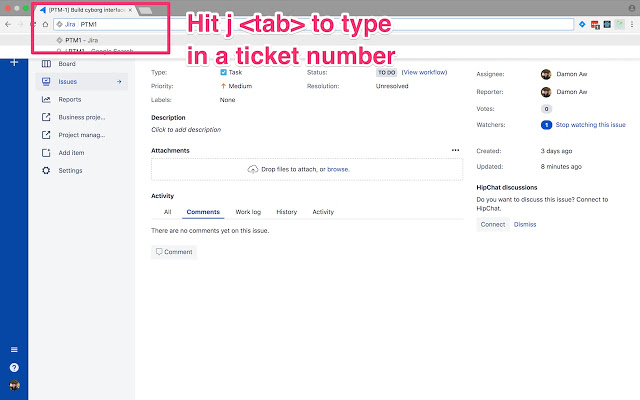

# Jira
This a Chrome extension to make using Jira more productive.

In my workplace, ticket numbers are frequently quoted among colleagues. For example: "Have you seen that card MDI-113?".The core idea in this product is to help users jump to the issue in the quickest way possible.

Currently, I've assumed that power users who might value this embrace keyboard shortcuts. The core feature is hitting `j + <tab>` in the omnibox and allowing the user to type an issue key. There are also supporting features like searching for issues and displaying information directly in the omnibox.

[Get the latest version](https://chrome.google.com/webstore/detail/jira/odofgglajlcgbjcbbifcehfhbalgeacl) of the extension on Chrome webstore.



## I have a features suggestion...
Great! Thank you. Please look at the [projects](https://github.com/daemonsy/jira/projects) to see if it's in the pipeline. But still open an issue, I'd like to know what's important to users.

## Development Guide

This project uses `yarn`.

### How doe the code work?
The extension is built via webpack as entry points to the individual Chrome extension components

- `popup.html`: For the popup UI
- `background.html`: For the Omnibox listeners
- `options.html`: Extension's options page

### Building the extension in development

Running `yarn start` builds the extension into the `./build` folder and you can load that into Chrome as an unpacked extension.

When you want to build it for release, just run `yarn run release`. It's generally good to test the release extension in the browser before submitting a PR.

### Running tests

To run tests:

```sh
yarn test
```

### What type of tests?

It's quite hard to test a Chrome extension. However, the nice thing is that in an extension, Chrome is basically a wrapper over a bunch of HTML and JS. It is possible to test the HTML pages.

Look at this [blog post](https://medium.com/damon-aw/working-with-background-pages-on-chrome-extensions-this-hack-will-change-your-life-b6df8a29d86) for example of inspecting a background page.

Generally, it's fine to add non end to end tests if you're submitting a PR to me, but make sure the core logic is covered by a test.

TODO: I need to add a test case where the HTML rendering is tested.
